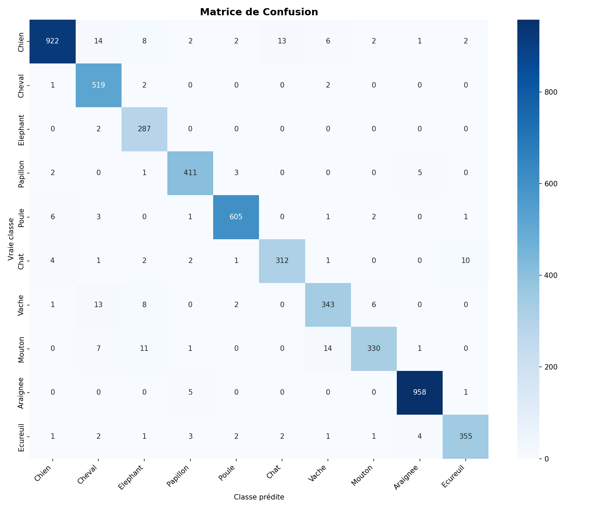
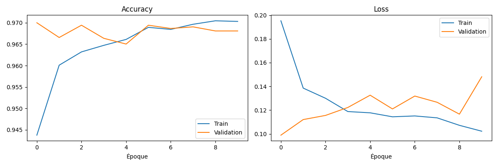
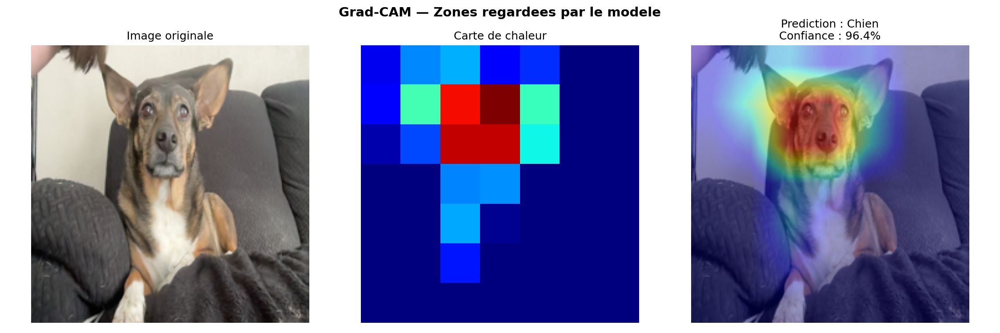

Classificateur d'animaux par intelligence artificielle, réalisé en Python avec TensorFlow.  
Basé sur le transfer learning d'EfficientNetB0 pré-entraîné.  
Précision de 97% sur les 5232 images (20% du dataset choisi sur kaggle pour l'entrainement du modele; répartition 80-20)

*** Lien Hugging Face : https://edrikbsm-animal-classifier.hf.space ***

Capable de reconnaître : Chien, Chat, Cheval, Mouton, Vache, Ecureil, Elephant, Araignee, Poule, Papillon, avec les résultats suivants :

  Classe  |  F1-score
  -------------------
| Araignée | 0.99 |
| Poule | 0.98 |
| Chien | 0.97 |
| Papillon | 0.97 |
| Cheval | 0.96 |
| Écureuil | 0.96 |
| Chat | 0.95 |
| Mouton | 0.94 |
| Éléphant | 0.94 |
| Vache | 0.93 |
matrice de confusion : 

Courbes résultat de l'entrainement du modèle (entraîné sur 10 epochs) : 

Réalisation d'un Grad-CAM en 7x7 : 

Infos Techniques : Python 3.9.6, TensorFlow M2 2.16, Streamlit
Pillow_NumPy_Matplotlib_Scikit-learn_Seaborn

Structure du projet :
animal_classifier/
|-train.py          # Entrainement du modele
|-evaluate.py       # Matrice de confusion
|-gradcam.py        # Grad-CAM, visualisation de l'information prélevée par le réseau neuronal
|-app.py            # Interface du projet (Streamlit)
|-models/           # Modèle d'entraînement
|-requirements.txt
  
Le modèle repose sur EfficientNetB0, une architecture légère de Google pré-entraînée sur 1.2 million d'images (ImageNet). Ses 4 millions de paramètres sont gelés — on réutilise son savoir sans le modifier. On y ajoute nos propres couches de classification : GlobalAveragePooling, une couche Dense de 256 neurones, un Dropout à 30% pour éviter l'overfitting, et une couche de sortie à 10 neurones. On utilise cela sur le dataset Animals-10 (trouvé sur Kaggle), qui contient 26 179 images réparties en 10 classes (10 espèces d'animaux).

---------------------------------------------------
pour lancer le projet : 

pip install -r requirements.txt
streamlit run app.py
---------------------------------------------------
